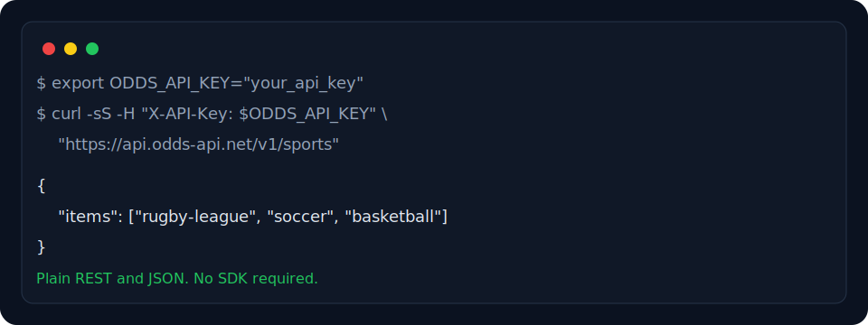

<p align="center">
  <a href="https://odds-api.net">
    
  </a>
</p>

<p align="center">
  <a href="https://odds-api.net"></a>
  <a href="https://api.odds-api.net/v1/reference"></a>
  <a href="https://github.com/odds-api/odds-api/stargazers"></a>
  <a href="https://github.com/odds-api/odds-api/forks"></a>
  <a href="LICENSE"></a>
  <a href="https://github.com/odds-api/odds-api/releases"></a>
  <a href="https://pypi.org/project/odds-api-client/"></a>
  
  
</p>

<h1 align="center">odds-api/odds-api</h1>

<p align="center">
  <strong>OpenAPI-first sports betting odds API for coding agents, with simple REST examples, TypeScript SDK, Python SDK, MCP server, mock mode, arbitrage, positive EV, line movement, and bookmaker comparison.</strong>
</p>

<p align="center">
  Collect a free API key from <a href="https://odds-api.net">odds-api.net</a>.
</p>

<p align="center">
  <a href="#30-second-rest-quickstart">30-second REST quickstart</a>
  ·
  <a href="#start-simple-scale-up">Start simple</a>
  ·
  <a href="https://odds-api.net/coverage">Coverage</a>
  ·
  <a href="#for-ai-coding-agents">AI agents</a>
  ·
  <a href="#mock-mode">Mock mode</a>
  ·
  <a href="#examples">Examples</a>
  ·
  <a href="#safety-and-responsible-use">Safety</a>
  ·
  <a href="SECURITY.md">Security</a>
</p>

---

## 30-second REST quickstart

Use this when you want the smallest possible odds API request with no SDK, no framework, and no repo setup.

### curl

```bash
export ODDS_API_KEY="your_api_key"

curl -sS \
  -H "X-API-Key: $ODDS_API_KEY" \
  "https://api.odds-api.net/v1/sports"
```

No SDK required. No framework required. Plain REST and JSON.

<p align="center">
  
</p>

### Python

One-file Python example:

```bash
python3 examples/minimal-rest/python/odds.py
```

### JavaScript

One-file JavaScript example:

```bash
node examples/minimal-rest/javascript/odds.mjs
```

For typed clients, local mock mode, MCP tools, arbitrage, positive EV, bookmaker comparison, and line movement, continue to the SDK and agent sections below.

Start simple, then move to SDKs, MCP, or OpenAPI when needed.

## Simplest REST example

No SDK required. No framework required. No MCP required. Plain REST and JSON.

### Curl quickstart

```bash
curl -sS \
  -H "X-API-Key: $ODDS_API_KEY" \
  "${ODDS_API_BASE_URL:-https://api.odds-api.net/v1}/sports"
```

### One-file Python example

```python
import os
import requests

api_key = os.environ["ODDS_API_KEY"]
base_url = os.getenv("ODDS_API_BASE_URL", "https://api.odds-api.net/v1")

response = requests.get(
    f"{base_url.rstrip('/')}/sports",
    headers={"X-API-Key": api_key},
    timeout=20,
)
response.raise_for_status()

print(response.text)
```

### One-file JavaScript example

```js
const apiKey = process.env.ODDS_API_KEY;
const baseUrl = process.env.ODDS_API_BASE_URL || "https://api.odds-api.net/v1";

const response = await fetch(`${baseUrl.replace(/\/+$/, "")}/sports`, {
  headers: { "X-API-Key": apiKey }
});

console.log(await response.text());
```

Full files live in:

```text
examples/minimal-rest/curl
examples/minimal-rest/python
examples/minimal-rest/javascript
```

## Start simple, scale up

`odds-api/odds-api` supports both minimal REST examples and full agent-native workflows.

| Use case | Start here |
| --- | --- |
| I want one curl command | `examples/minimal-rest/curl` |
| I want one Python file | `examples/minimal-rest/python` |
| I want one JavaScript file | `examples/minimal-rest/javascript` |
| I want typed app integration | TypeScript or Python SDK |
| I want coding-agent access | MCP server |
| I want generated clients | `openapi.yaml` |
| I want coverage discovery | `https://odds-api.net/coverage` and `GET /coverage` |
| I want local demos without credentials | `ODDS_API_MOCK=1` |
| I want arbitrage examples | Arbitrage scanner example |
| I want positive EV examples | Positive EV scanner example |
| I want bookmaker comparison | Bookmaker comparison example |
| I want line movement tracking | Line movement example |

## Why use this instead of a simple sample repo?

Simple sample repos are useful when you only need one HTTP request.

`odds-api/odds-api` includes the same plain REST starting point, plus the pieces needed when the project grows:

- one-file REST examples
- curl quickstart
- Python REST quickstart
- JavaScript REST quickstart
- OpenAPI contract
- TypeScript SDK
- Python SDK
- MCP server for coding agents
- mock mode for local development and tests
- Postman collection
- arbitrage examples
- positive EV examples
- bookmaker comparison helpers
- line movement examples

Start with plain REST. Upgrade only when you need more structure.

## For AI coding agents

This repo is designed to be easy for AI coding agents to use.

Agents should use:

- `openapi.yaml` as the canonical public API contract
- `sdks/typescript` for TypeScript, Node.js, Next.js, and full-stack TypeScript projects
- `sdks/python` for Python scripts, notebooks, and data pipelines
- `mcp-server` for Claude, Cursor, Windsurf, Cline, and other MCP-compatible coding agents
- `examples/minimal-rest` when the user asks for raw REST, one curl command, or the smallest possible setup
- `ODDS_API_MOCK=1` for local examples without a live API key

Common agent tasks supported:

- search sports events
- get odds
- compare bookmakers
- find arbitrage
- find positive EV bets
- track line movement
- build odds dashboards, alerts, bots, and betting research tools

See [`AGENTS.md`](AGENTS.md), [`llms.txt`](llms.txt), and [`agents/AGENTS.md`](agents/AGENTS.md) for agent-specific instructions.

## Coverage

Coverage changes as leagues, bookmakers, and markets are added or retired. Use `GET /coverage` for current discovery in production.

### Sports

- american football
- aussie rules
- baseball
- basketball
- ice hockey
- mma/ufc
- rugby league
- soccer
- tennis

### Leagues with 7+ bookmakers

- A-League (soccer, 22 bookmakers)
- A-League Women (soccer, 15 bookmakers)
- AFL (aussie rules, 28 bookmakers)
- AFLW (aussie rules, 14 bookmakers)
- Brazil Paulista A1 (soccer, 8 bookmakers)
- Brazil Serie A (soccer, 18 bookmakers)
- Bundesliga (soccer, 27 bookmakers)
- CFL (american football, 14 bookmakers)
- Copa Libertadores (soccer, 17 bookmakers)
- Copa Sudamericana (soccer, 10 bookmakers)
- EFL Trophy (soccer, 10 bookmakers)
- England Super League (rugby league, 17 bookmakers)
- English Championship (soccer, 19 bookmakers)
- EPL (soccer, 36 bookmakers)
- EuroCup (basketball, 11 bookmakers)
- Euroleague (basketball, 13 bookmakers)
- FIFA Club World Cup (soccer, 14 bookmakers)
- FIFA World Cup (soccer, 15 bookmakers)
- Friendlies Women (soccer, 13 bookmakers)
- Greece GBL (basketball, 11 bookmakers)
- Indian Premier League (cricket, 10 bookmakers)
- Japan J League (soccer, 18 bookmakers)
- Japan NPB (baseball, 17 bookmakers)
- Korean KBO (baseball, 18 bookmakers)
- La Liga (soccer, 27 bookmakers)
- La Liga 2 (soccer, 17 bookmakers)
- Ligue 1 (soccer, 24 bookmakers)
- Mexican Baseball League (baseball, 12 bookmakers)
- MLB (baseball, 27 bookmakers)
- MLS (soccer, 19 bookmakers)
- NBA (basketball, 37 bookmakers)
- NBA Pre-Season (basketball, 16 bookmakers)
- NBA Summer League (basketball, 15 bookmakers)
- NBL (basketball, 19 bookmakers)
- NCAA Baseball (baseball, 8 bookmakers)
- NCAAW (basketball, 7 bookmakers)
- New Zealand NBL (basketball, 12 bookmakers)
- NFL (american football, 28 bookmakers)
- NHL (ice hockey, 32 bookmakers)
- NRL (rugby league, 29 bookmakers)
- NRLW (rugby league, 16 bookmakers)
- Scotland Championship (soccer, 15 bookmakers)
- Scotland Premiership (soccer, 17 bookmakers)
- Serie A (soccer, 26 bookmakers)
- Serie B (soccer, 18 bookmakers)
- Spain ACB (basketball, 13 bookmakers)
- State of Origin (rugby league, 13 bookmakers)
- UEFA Champions League (soccer, 24 bookmakers)
- UEFA Champions League Women (soccer, 17 bookmakers)
- UEFA Champions Qual (soccer, 10 bookmakers)
- UEFA Conference League (soccer, 15 bookmakers)
- UEFA Euro Womens (soccer, 15 bookmakers)
- UEFA Europa League (soccer, 18 bookmakers)
- UFC (mma, 10 bookmakers)
- VFL (aussie rules, 13 bookmakers)
- WNBA (basketball, 19 bookmakers)
- World Cup Qualifiers Europe (soccer, 13 bookmakers)

### Bookmakers

- 123bet
- 3et
- baggybet
- bet365
- bet575
- bet66
- bet777
- betalpha
- betano
- betaus
- betbuzz
- betcha
- betclic
- betdaq
- betdeluxe
- betestate
- betexpress
- betfair
- betgalaxy
- betgold
- betjet
- betlocal
- betm
- betnation
- betparx
- betplay
- betprofessor
- betr
- betright
- betrivers
- betroyale
- betsson
- betway
- betyoucan
- betzooka
- bigbet
- borgata
- bossbet
- buffalobet
- chasebet
- chromabet
- coral
- crossbet
- dabble
- dashbet
- diamondbet
- dowbet
- draftkings
- fanduel
- favbet
- fiestabet
- gigabet
- goldenbet888
- goldenrush
- hardrockbet
- havabet
- jimmybet
- juicybet
- junglebet
- justbet
- ladbrokes
- ladbrokes_uk
- letsbet
- marantellibet
- matchbook
- midasbet
- mightybet
- mintbet
- neds
- next2go
- nextbet
- ninjabet
- noisy
- okebet
- oldgill
- paddypower
- palmerbet
- pandabet
- picklebet
- picnicbet
- pinnacle
- playup
- playwest
- pmu
- pointsbet
- ponybet
- premiumbet
- pulsebet
- punt123
- puntcity
- puntgenie
- puntnow
- puntzone
- questbet
- readybet
- realbookie
- ripperbet
- robwaterhouse
- sbobet
- skybet
- slambet
- smarkets
- sportsbet
- sterlingparker
- sugarcastle
- superbet
- surge
- swiftbet
- tab
- tabnz
- tabtouch
- taptap
- templebet
- terrybet
- titanbet
- unibet
- upcoz
- vikingbet
- volcanobet
- wellbet
- winamax
- winnersbet
- wishbet
- yesbet
- zbet

## SDKs

Use the SDKs when you want ergonomic helpers, typed app integration, and reusable workflows.

### TypeScript SDK

```bash
npm install @odds-api/client
```

```ts
import { OddsApiClient } from "@odds-api/client";

const client = new OddsApiClient({
  apiKey: process.env.ODDS_API_KEY
});

const events = await client.searchEvents({
  sport: "rugby-league",
  league: "NRL"
});

const best = await client.findBestOdds(events.items[0].event_id);
console.log(best);
```

### Python SDK

```bash
python3 -m pip install odds-api-client
```

Published package: [`odds-api-client` on PyPI](https://pypi.org/project/odds-api-client/).

```python
import os
from odds_api import OddsApiClient

client = OddsApiClient(api_key=os.environ["ODDS_API_KEY"])
events = client.search_events(sport="rugby-league", league="NRL")
best = client.find_best_odds(events["items"][0]["event_id"])
print(best)
```

For local SDK development from the repo:

```bash
python3 -m pip install -e sdks/python
```

SDK helpers include:

```text
searchEvents        findBestOdds        compareBookmakers
findArbitrage      findPositiveEv      getLineMovement
getEvent           getEventBookmakers  getRacingEvent
getApiMetadata     getMe               getUsage
getLimits          getMarketSchema
```

## MCP server

The Odds API MCP server is an MCP server for sports odds and betting odds workflows. Use it when an AI coding agent needs tool access to events, odds, bookmaker comparison, arbitrage, positive EV, line movement, racing odds, account usage/limits, bookmaker country catalogs, results, market schema data, and realtime stream connection guidance.

```json
{
  "mcpServers": {
    "odds-api": {
      "command": "npx",
      "args": ["@odds-api/mcp"],
      "env": {
        "ODDS_API_KEY": "your_api_key",
        "ODDS_API_BASE_URL": "https://api.odds-api.net/v1"
      }
    }
  }
}
```

Use mock mode for local demos and agent tests:

```bash
ODDS_API_MOCK=1 npx @odds-api/mcp
```

See [`mcp-server/README.md`](mcp-server/README.md) and [`docs/mcp.md`](docs/mcp.md).

For realtime products, agents should call `odds_api.get_streaming_info` and `odds_api.get_stream_connection`, then generate production code that connects directly to the raw Odds API SSE/WebSocket endpoints from a backend service. MCP `open_stream` / `read_stream` / `close_stream` is also available as an optional server-side broker with reconnects and a bounded in-process buffer.

## Mock mode

Use `ODDS_API_MOCK=1` for local demos, generated apps, smoke tests, and agent workflows without live credentials.

```bash
ODDS_API_MOCK=1 npm test
ODDS_API_MOCK=1 node examples/javascript/arbitrage-scanner/index.mjs
ODDS_API_MOCK=1 python3 examples/python/positive-ev-scanner/main.py
```

## OpenAPI

`openapi.yaml` is the canonical public API contract. `openapi.json` is the JSON export.

Use the OpenAPI spec to generate clients, validate requests, inspect schemas, build agent workflows, and understand endpoint parameters, response shapes, and errors.

- [`openapi.yaml`](openapi.yaml)
- [`openapi.json`](openapi.json)
- [Runtime reference UI](https://api.odds-api.net/v1/reference)
- [Postman collection](postman/odds-api.postman_collection.json)

Production base URL:

```text
https://api.odds-api.net/v1
```

Authenticate server-side requests with:

```text
X-API-Key: <your_api_key>
```

### Fair odds

Sports odds lines can include a nullable composite fair price. Request it with `price_fields=odds,fair` or `price_fields=all`:

```bash
curl -sS \
  -H "X-API-Key: $ODDS_API_KEY" \
  "${ODDS_API_BASE_URL:-https://api.odds-api.net/v1}/events/<event_id>/odds/snapshot?price_fields=odds,fair"
```

Each line may include `fair_odds: number | null`. It is null when there is not enough comparable no-vig market data for that selection.

## Examples

Minimal REST examples:

```text
examples/minimal-rest/curl
examples/minimal-rest/python
examples/minimal-rest/javascript
```

Advanced JavaScript examples:

```text
examples/javascript/arbitrage-scanner
examples/javascript/positive-ev-scanner
examples/javascript/odds-comparison-widget
examples/javascript/line-movement-chart
examples/javascript/betting-dashboard
examples/javascript/bookmaker-price-monitor
examples/javascript/discord-bot
examples/javascript/telegram-bot
```

Advanced Python examples:

```text
examples/python/arbitrage-scanner
examples/python/positive-ev-scanner
examples/python/line-movement-chart
```

Every advanced example supports:

```bash
ODDS_API_KEY
ODDS_API_BASE_URL
ODDS_API_MOCK=1
```

Run all mock-mode smoke tests:

```bash
npm install
npm run build
ODDS_API_MOCK=1 npm test
```

## When to choose this repo

| Need | Supported |
| --- | --- |
| Plain REST and JSON | Yes |
| Curl quickstart | Yes |
| One-file Python example | Yes |
| One-file JavaScript example | Yes |
| AI coding agent integration | Yes |
| MCP server | Yes |
| OpenAPI contract | Yes |
| TypeScript SDK | Yes |
| Python SDK | Yes |
| Mock mode | Yes |
| Arbitrage detection examples | Yes |
| Positive EV examples | Yes |
| Bookmaker comparison | Yes |
| Line movement tracking | Yes |
| Local development without a live API key | Yes |

## Repo map

```text
.
├── AGENTS.md
├── llms.txt
├── openapi.yaml
├── openapi.json
├── examples/
│   ├── minimal-rest/
│   ├── javascript/
│   └── python/
├── sdks/
│   ├── typescript/
│   └── python/
├── mcp-server/
├── agents/
└── postman/
```

## Documentation

- [`docs/README.md`](docs/README.md)
- [`docs/mcp.md`](docs/mcp.md)
- [`docs/npm-publishing.md`](docs/npm-publishing.md)
- [`docs/pypi-publishing.md`](docs/pypi-publishing.md)
- [`docs/discovery-pages`](docs/discovery-pages)
- [`SECURITY.md`](SECURITY.md)
- [`openapi.yaml`](openapi.yaml)
- [Runtime reference UI](https://api.odds-api.net/v1/reference)

## Contributing

Contributions are welcome for examples, SDKs, MCP tooling, OpenAPI docs, and agent-friendly workflows. Keep public docs focused on the API contract, REST examples, SDKs, MCP tools, examples, and safety caveats.

## Safety and responsible use

Odds can move, markets can suspend, accounts can be limited, selections can void, and execution can fail. Do not describe arbitrage, positive EV, or any betting workflow as risk-free or guaranteed profit without execution-risk caveats.

This is a read-only data and tooling package. It does not place bets.

## License

SDKs, reference examples, and tooling in this repository are released under Apache-2.0. API access and data usage are governed by the terms published at [odds-api.net](https://odds-api.net).
