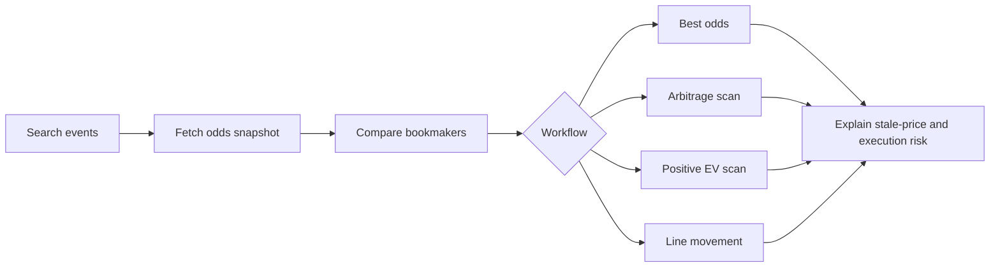

<p align="center">
  <a href="https://odds-api.net">
    
  </a>
</p>

<p align="center">
  <a href="https://odds-api.net"></a>
  <a href="https://api.odds-api.net/v1/reference"></a>
  
  
  
</p>

<h1 align="center">Odds API</h1>

<p align="center">
  A public developer package for building odds comparison widgets, arbitrage scanners, positive EV dashboards, alert bots, line-movement tools, bookmaker monitors, and coding-agent workflows on top of <strong>api.odds-api.net</strong>.
</p>

<p align="center">
  <a href="#quick-start">Quick Start</a>
  ·
  <a href="#what-you-get">What You Get</a>
  ·
  <a href="#agent-workflows">Agent Workflows</a>
  ·
  <a href="#examples">Examples</a>
  ·
  <a href="#safety">Safety</a>
</p>

---

## At A Glance

| Area | Details |
| --- | --- |
| Website | [odds-api.net](https://odds-api.net) |
| API base URL | `https://api.odds-api.net/v1` |
| Reference UI | [api.odds-api.net/v1/reference](https://api.odds-api.net/v1/reference) |
| Auth | `X-API-Key` first for server-side integrations |
| Mock mode | `ODDS_API_MOCK=1` runs examples without secrets |
| Package targets | `@odds-api/client`, `@odds-api/mcp`, `odds-api-client` |
| Public scope | Read-only odds, events, metadata, results, racing data, examples, SDKs, MCP tools |

This repository is the public developer package. The production `/v1` service exports `openapi.yaml` and `openapi.json`; consumers should treat those files as the contract for generated clients and agent tooling.

## Quick Start

```bash
git clone git@github.com:odds-api/odds-api.git
cd odds-api

export ODDS_API_KEY="your_api_key"
export ODDS_API_BASE_URL="https://api.odds-api.net/v1"

npm install
npm run build
node examples/javascript/positive-ev-scanner/index.mjs
```

Run the full local suite, including example smoke tests, without credentials:

```bash
ODDS_API_MOCK=1 npm test
```

<details>
<summary><strong>TypeScript SDK</strong></summary>

```ts
import { OddsApiClient } from "@odds-api/client";

const client = new OddsApiClient({
  apiKey: process.env.ODDS_API_KEY,
  baseUrl: process.env.ODDS_API_BASE_URL
});

const events = await client.searchEvents({
  sport: "rugby-league",
  league: "NRL"
});

const odds = await client.getOddsSnapshot(events.items[0].event_id);
const best = client.findBestOdds(odds.items);
```

</details>

<details>
<summary><strong>Python SDK</strong></summary>

```python
from odds_api import OddsApiClient

client = OddsApiClient()
events = client.search_events(sport="rugby-league", league="NRL")
odds = client.get_odds_snapshot(events["items"][0]["event_id"])
best = client.find_best_odds(odds["items"])
```

</details>

<details>
<summary><strong>MCP Server</strong></summary>

```json
{
  "mcpServers": {
    "odds-api": {
      "command": "npx",
      "args": ["@odds-api/mcp"],
      "env": {
        "ODDS_API_KEY": "your_api_key",
        "ODDS_API_BASE_URL": "https://api.odds-api.net/v1"
      }
    }
  }
}
```

</details>

## What You Get

| Capability | Included |
| --- | --- |
| OpenAPI contract | `openapi.yaml`, `openapi.json` |
| TypeScript SDK | typed client, helper methods, tests |
| Python SDK | typed-ish ergonomic client, helper methods, tests |
| MCP server | agent tools backed by the TypeScript SDK |
| Examples | JavaScript and Python apps with mock mode |
| Agent instructions | Codex, Claude, Cursor, Copilot, and skill files |
| Postman | importable collection for quick manual requests |
| CI | build, tests, OpenAPI lint, and mock-mode smoke tests |

### SDK Helpers

The SDKs include direct endpoint access plus workflow helpers:

```text
searchEvents        findBestOdds        compareBookmakers
findArbitrage      findPositiveEv      getLineMovement
getMarketSchema
```

### MCP Tools

```text
odds_api.search_events
odds_api.get_odds
odds_api.compare_odds
odds_api.find_arbitrage
odds_api.find_positive_ev
odds_api.get_line_movement
odds_api.get_bookmakers
odds_api.get_sports
odds_api.get_market_schema
```

## Agent Workflows



Agents should use `openapi.yaml` as the source contract, prefer the SDKs when writing code, and fall back to direct HTTP only when necessary. See [`agents/AGENTS.md`](agents/AGENTS.md) for betting concepts, endpoint workflows, stale odds handling, caching, rate limits, and responsible gambling language.

## Examples

JavaScript:

```text
examples/javascript/odds-comparison-widget
examples/javascript/arbitrage-scanner
examples/javascript/positive-ev-scanner
examples/javascript/discord-bot
examples/javascript/telegram-bot
examples/javascript/line-movement-chart
examples/javascript/betting-dashboard
examples/javascript/bookmaker-price-monitor
```

Python:

```text
examples/python/arbitrage-scanner
examples/python/positive-ev-scanner
examples/python/line-movement-chart
```

Every example supports:

```bash
ODDS_API_KEY
ODDS_API_BASE_URL
ODDS_API_MOCK=1
```

## API Reference

- [`openapi.yaml`](openapi.yaml)
- [`openapi.json`](openapi.json)
- [Runtime reference UI](https://api.odds-api.net/v1/reference)
- [Postman collection](postman/odds-api.postman_collection.json)

Use `X-API-Key` for server-side integrations. Bearer tokens are supported only for current app-user flows where the API allows them.

## Repo Map

```text
.
├── openapi.yaml
├── openapi.json
├── examples/
├── sdks/
│   ├── typescript/
│   └── python/
├── mcp-server/
├── agents/
└── postman/
```

## Safety

Odds can move, markets can suspend, accounts can be limited, selections can void, and execution can fail. Do not describe arbitrage, positive EV, or any betting workflow as risk-free or guaranteed profit without execution-risk caveats.

This is a read-only data and tooling package. It does not place bets.

## License

SDKs, examples, and tooling in this repository are released under Apache-2.0. API access and data usage are governed by the terms published at [odds-api.net](https://odds-api.net).
